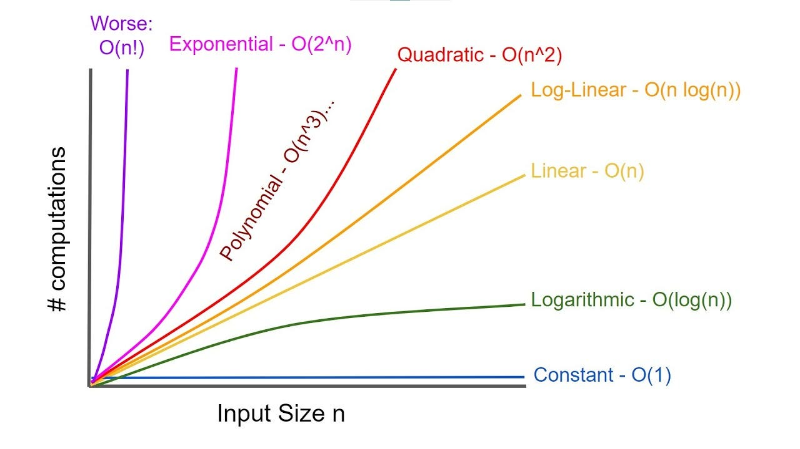

# Data-Structures-and-Algorithms

Data Structures and Algorithms in C++
---
### Elementary Data Structures
- Array
- Matrices
- Linked List
1. Singly Linked List
2. Doubly Linked List
3. Circular Singly Linked List
4. Circular Doubly Linked List
- Stack
1. Stack Implementation using Fixed Sized Array
2. Stack Implementation using Dynamic Array or Vector
3. Stack Implementation Linked Lists
- Queue
1. Queue Implementation using Fixed Sized Array
2. Queue Implementation using Dynamic Array or Vector
3. Queue Implementation Linked Lists
- Hash Table
1. Hash Function
2. Open Addressing
3. Chaining

### Time Complexity

- **O(1):** 
Constant time complexity, operations that take the same time regardless of input size.
- **O(N):** 
Linear time complexity, operations that scale linearly with input size.
- **O(N^2):** 
Quadratic time complexity, operations that involve nested iterations over input data.
- **O(logN):** 
Logarithmic time complexity, operations that reduce the problem size in each step.
- **O(NlogN):** 
Log-linear time complexity, operations that divide the problem into smaller subproblems and process each independently.

Time Complexity of different Data Structures and Algorithms

